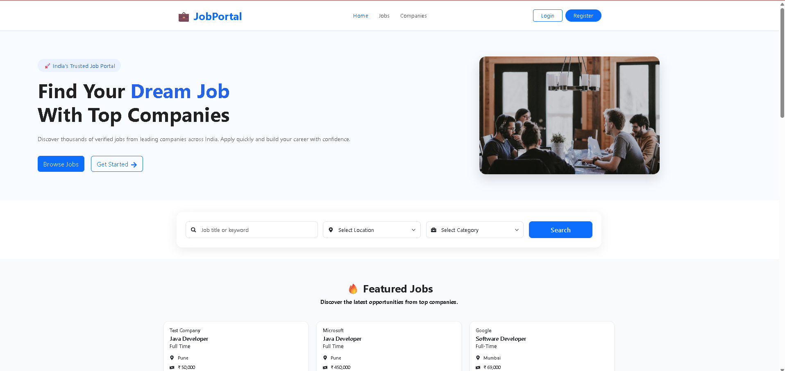
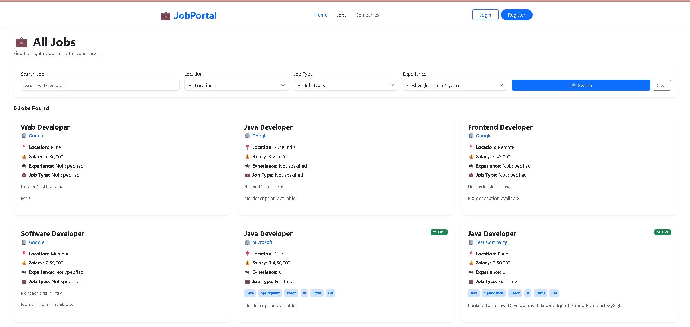
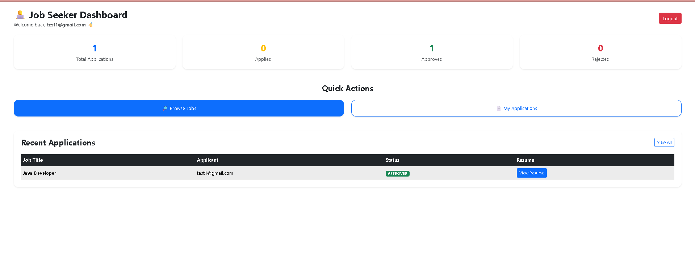
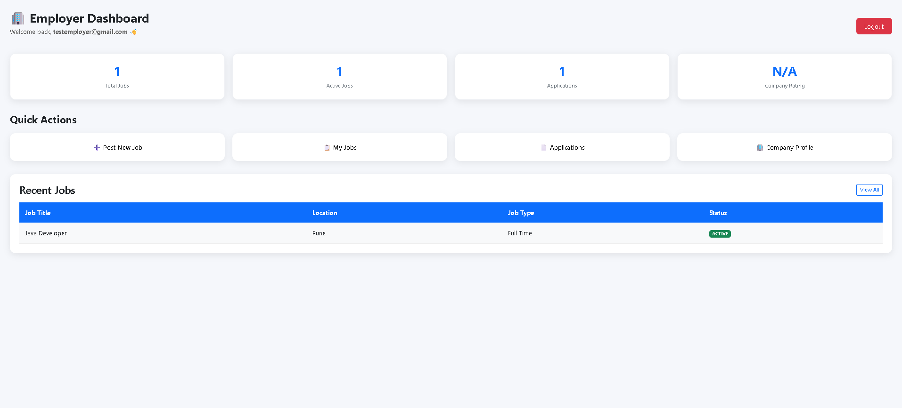
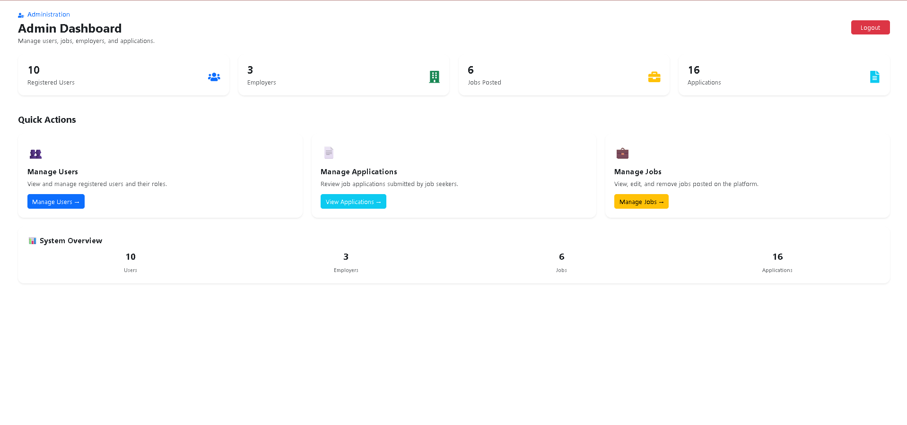

# 💼 Job Portal

A full-stack Job Portal web application built with **React.js, Spring Boot, Spring Security, JWT, Hibernate, and MySQL**.

The platform provides separate workflows for **Job Seekers, Employers, and Administrators**, including authentication, job management, job search and filtering, job applications, resume upload, application tracking, company profiles, and dashboards.

## 📌 Project Overview

The Job Portal connects job seekers and employers through a centralized web application.

### Job Seeker Features
- Register and login securely
- Browse available jobs
- Search by job title and location
- Filter by job type and experience
- View complete job details
- Apply for jobs
- Upload PDF resumes
- Prevent duplicate applications
- Track application status
- View application history
- Use a personalized dashboard

### Employer Features
- Register as an employer
- Create and manage company profile
- Post new jobs
- Edit and delete jobs
- View employer-specific jobs
- View applications received
- Approve or reject applications
- View applicant resumes
- Track jobs and applications from dashboard

### Admin Features
- Role-based admin login
- View all registered users
- View user roles
- Delete users
- View all applications
- Monitor jobs and platform statistics
- Manage platform-level user and application information

## ✨ Core Features

### Authentication & Security
- User registration
- Job seeker registration
- Employer registration
- JWT-based authentication
- Role-based authorization
- Roles: `ADMIN`, `EMPLOYER`, `JOBSEEKER`
- BCrypt password hashing
- Protected frontend routes
- Role-based dashboard redirection
- Logout
- Invalid-token handling
- Sensitive application configuration excluded from Git

### Job Management
- Create, read, update and delete jobs
- Job title, company, location, salary, experience and job type
- Required skills and description
- Active job status
- Employer-specific job listing

### Job Search & Filtering
- Search by title
- Search by location
- Filter by job type
- Filter by experience
- Clear filters

### Applications
- Apply for jobs
- Upload resume
- PDF and file-size validation
- Duplicate application check
- Track application status
- Employer approval/rejection
- Resume viewing by employer/admin

### Company Profiles
- Company name
- HR name
- Phone
- Website
- Industry
- Company size
- Company description
- View and edit profile

### Dashboards
- Job seeker dashboard
- Employer dashboard
- Admin dashboard
- Live counts for relevant users/jobs/applications
- Recent activity sections
- Quick actions

## 🛠️ Technologies Used

### Frontend
- **React.js** – UI development
- **JavaScript (ES6+)** – application logic
- **React Router DOM** – routing
- **Axios** – REST API communication
- **Bootstrap** – responsive UI and layout
- **CSS3** – custom styling
- **React Icons** – icons
- **SweetAlert2** – alerts and confirmation dialogs
- **Vite** – development/build tool

### Backend
- **Java** – backend development
- **Spring Boot** – backend framework
- **Spring MVC** – REST APIs
- **Spring Data JPA** – database access
- **Hibernate** – ORM
- **Spring Security** – authentication and authorization
- **JWT** – token-based authentication
- **BCrypt** – password hashing
- **Maven** – dependency/build management

### Database
- **MySQL** – relational database
- **JPA/Hibernate** – object-relational mapping

### Development Tools
- Spring Tools for Eclipse (STS)
- Visual Studio Code
- MySQL Workbench
- Git
- GitHub
- npm

## 🏗️ Architecture

```text
React Frontend
      |
      | REST API / JSON
      v
Spring Boot Backend
      |
      +-- Controller
      +-- Service
      +-- Repository
      +-- Entity
      +-- DTO
      +-- Security / JWT
      |
      v
Hibernate / JPA
      |
      v
MySQL
```

## 📁 Project Structure

```text
JobPortal/
├── backend/
│   ├── src/
│   │   ├── main/
│   │   │   ├── java/com/example/demo/
│   │   │   │   ├── config/
│   │   │   │   ├── controller/
│   │   │   │   ├── dto/
│   │   │   │   ├── entity/
│   │   │   │   ├── exception/
│   │   │   │   ├── repository/
│   │   │   │   ├── security/
│   │   │   │   ├── service/
│   │   │   │   └── service/impl/
│   │   │   └── resources/
│   │   └── test/
│   ├── pom.xml
│   ├── mvnw
│   └── mvnw.cmd
├── frontend/
│   └── jobportal-frontend/
│       ├── public/
│       ├── src/
│       │   ├── assets/
│       │   ├── components/
│       │   ├── pages/
│       │   │   ├── admin/
│       │   │   ├── auth/
│       │   │   ├── employer/
│       │   │   └── jobseeker/
│       │   ├── services/
│       │   └── styles/
│       ├── package.json
│       ├── package-lock.json
│       └── vite.config.js
└── .gitignore
```

## 🔗 Main REST APIs

### Authentication
```text
POST /api/users
POST /api/login
```

### Users
```text
GET /api/users
GET /api/users/count
DELETE /api/users/{id}
```

### Jobs
```text
GET /api/jobs
GET /api/jobs/{id}
POST /api/jobs
PUT /api/jobs/{id}
DELETE /api/jobs/{id}
GET /api/jobs/filter
GET /api/jobs/employer/{email}
GET /api/jobs/count
```

### Applications
```text
POST /api/applications
GET /api/applications
GET /api/applications/user/{email}
GET /api/applications/employer/{email}
GET /api/applications/check
PUT /api/applications/{id}/status
POST /api/applications/upload
```

### Employer
```text
GET /api/employer
GET /api/employer/{id}
GET /api/employer/profile/{email}
POST /api/employer
PUT /api/employer/{id}
DELETE /api/employer/{id}
```

## 🚀 How to Run

### Prerequisites
- Java
- Maven
- Node.js
- npm
- MySQL
- Git

### 1. Clone

```bash
git clone https://github.com/Shreyash9330/JobPortal.git
cd JobPortal
```

### 2. Backend

```bash
cd backend
```

Configure your local database and JWT settings in:

```text
src/main/resources/application.properties
```

The real configuration file is excluded from GitHub.

Windows:

```cmd
mvnw.cmd spring-boot:run
```

Linux/macOS:

```bash
./mvnw spring-boot:run
```

Backend:

```text
http://localhost:8080
```

### 3. Frontend

Open another terminal:

```bash
cd frontend/jobportal-frontend
npm install
npm run dev
```

Frontend:

```text
http://localhost:5173
```

## 🗄️ Database Setup

Example:

```sql
CREATE DATABASE jobportal;
```

Then configure the local database connection and JWT secret in:

```text
backend/src/main/resources/application.properties
```

Do not commit credentials or JWT secrets to GitHub.

## 🔄 Application Flow

```text
User
 |
 +-- Register
 |
 +-- Login
 |
 v
JWT Authentication
 |
 v
Role Detection
 |
 +----------------+----------------+
 |                |                |
 v                v                v
JOBSEEKER       EMPLOYER          ADMIN
 |                |                |
 + Browse Jobs    + Post Jobs      + Manage Users
 + Apply Jobs     + Manage Jobs    + View Applications
 + Track Status   + Manage Apps    + Monitor Statistics
```

## 📱 Responsive UI

The application is designed for:
- Desktop
- Tablet
- Mobile

The navigation includes a mobile menu for smaller screens.

## ✅ Validation & UX

- Required field validation
- Email validation
- Password validation
- Password confirmation
- Mobile number validation
- Resume validation
- Loading states
- Empty states
- Error handling
- Confirmation dialogs
- Success messages
- Protected routes
- Role-based navigation
- Show/hide password controls

## 🎯 Key Learning Outcomes

This project demonstrates practical experience with:
- Full-stack web development
- React component-based architecture
- REST API development
- Spring Boot
- Spring MVC
- Layered architecture
- JPA and Hibernate
- MySQL integration
- JWT authentication
- Role-based authorization
- BCrypt password hashing
- CRUD operations
- File upload handling
- Form validation
- Axios API integration
- Exception handling
- Git and GitHub
- Responsive UI development

## 🔮 Future Enhancements

- Forgot password / password reset
- Email notifications
- Advanced job recommendations
- Pagination
- Sorting and advanced filtering
- Profile photo and company logo upload
- Cloud-based resume storage
- Production deployment
- Improved admin analytics
- Automated testing


## 📸 Screenshots

### 💼 Home Page


### 🔎 Job Listing


### 👤 Job Seeker Dashboard


### 🏢 Employer Dashboard


### 👑 Admin Dashboard


## 👨‍💻 Author

**Shreyash Gawande**

BE - Computer Science & Engineering

GitHub:  
https://github.com/Shreyash9330

## 📌 Repository

https://github.com/Shreyash9330/JobPortal

## 📄 License

This project was created for learning, portfolio, and demonstration purposes.
